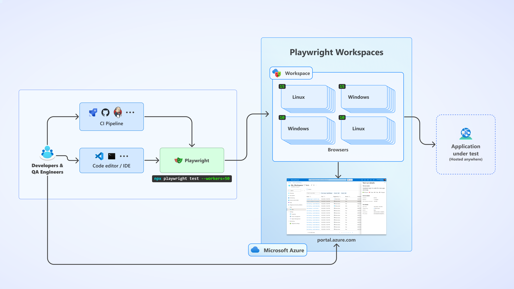
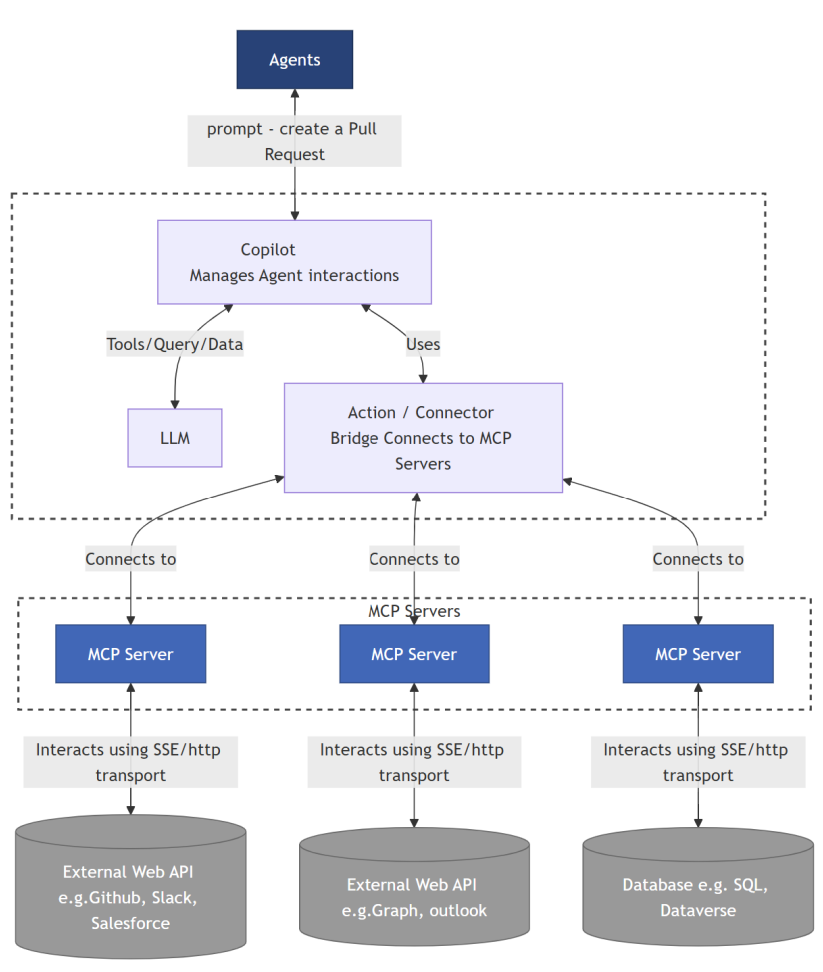
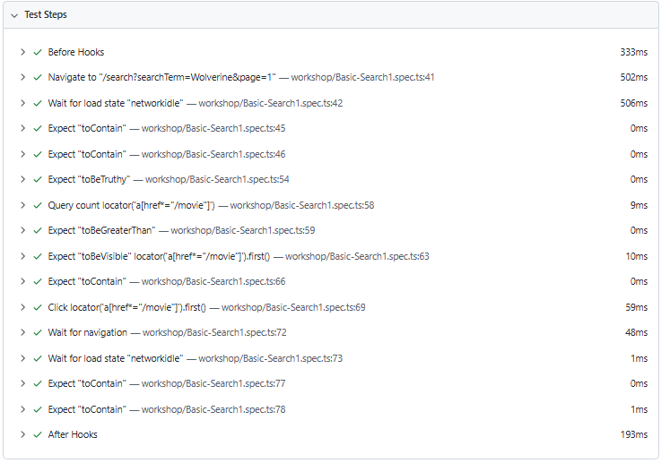
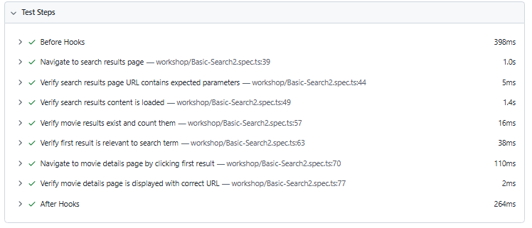

# Accelerating Playwright Test Automation with GitHub Copilot and Model Context Protocol (MCP)

## Course Overview

This course module demonstrates how GitHub Copilot and Model Context Protocol (MCP) integration with Playwright accelerate, refine, and scale test automation. Each module is structured around real prompts and includes evaluation criteria to ensure readiness before advancing. Rather than relying on manual `playwright codegen`, you'll learn to transform prompts into production-ready test suites.

**Target Audience:** QA Engineers, Test Automation Engineers, DevOps professionals  
**Duration:** 4-6 hours of hands-on practice  
**Prerequisites:** Basic Playwright knowledge, familiarity with TypeScript  
**Theme:** From prompt to test automation using GitHub Copilot and MCP

---

## Table of Contents

*   [Course Overview](#course-overview)
*   [Table of Contents](#table-of-contents)
*   [Initial Setup: Microsoft Playwright Testing (Cloud Browsers)](#initial-setup-microsoft-playwright-testing-cloud-browsers)
*   [Architecture Overview](#architecture-overview)
*   [Demo Application Setup 🎬](#demo-application-setup-)
    *   [Installation](#installation)
    *   [Environment Setup for Login Tests](#environment-setup-for-login-tests)
    *   [Running the Demo Application](#running-the-demo-application)
    *   [Running Tests](#running-tests)
    *   [Application Architecture](#application-architecture)
*   [Prerequisites: Setting Up MCP Servers in GitHub Copilot](#prerequisites-setting-up-mcp-servers-in-github-copilot)
    *   [Required MCP Servers](#required-mcp-servers)
    *   [1\. Context7 (for documentation lookup)](#1-context7-for-documentation-lookup)
    *   [2\. Playwright MCP (from Microsoft)](#2-playwright-mcp-from-microsoft)
    *   [3\. GitHub MCP (for repository context)](#3-github-mcp-for-repository-context)
    *   [4\. Copilot instructions generated at .github/instructions/copilot-instructions.md](#4-copilot-instructions-generated-at-githubinstructionscopilot-instructionsmd)
    *   [Test generation workflow](#test-generation-workflow)
    *   [Running the app](#running-the-app)
    *   [5\. Installation Checklist](#5-installation-checklist)
    *   [Moving Forward](#moving-forward)
*   [Module 1: The Complete End-to-End Workflow](#module-1-the-complete-end-to-end-workflow)
    *   [1.1 Workflow Overview](#11-workflow-overview)
    *   [1.2 Time Comparison: Manual vs. AI-Assisted](#12-time-comparison-manual-vs-ai-assisted)
*   [Module 2: From Manual to AI-Driven](#module-2-from-manual-to-ai-driven)
    *   [2.1 The Manual Codegen Problem](#21-the-manual-codegen-problem)
    *   [2.2 The AI-Assisted Alternative](#22-the-ai-assisted-alternative)
    *   [2.3 Understanding Your Codebase](#23-understanding-your-codebase)
    *   [2.4 Evaluation Criteria ✓](#24-evaluation-criteria-)
*   [Module 3: Test Planning from Application Analysis](#module-3-test-planning-from-application-analysis)
    *   [3.1 Creating Your Comprehensive Test Plan](#31-creating-your-comprehensive-test-plan)
    *   [3.2 Evaluation Criteria ✓](#32-evaluation-criteria-)
*   [Module 4: Rapid Test Generation from Scenarios](#module-4-rapid-test-generation-from-scenarios)
    *   [4.1 From Test Plan to Working Code](#41-from-test-plan-to-working-code)
    *   [4.2 Key Outcomes](#42-key-outcomes)
*   [Module 5: Test Steps for Better Reporting](#module-5-test-steps-for-better-reporting)
    *   [5.1 Using test.step() for Clarity](#51-using-teststep-for-clarity)
    *   [5.2 Benefits & Best Practices](#52-benefits--best-practices)
    *   [5.3 Evaluation Criteria ✓](#53-evaluation-criteria-)
*   [Module 6: API Testing Automation](#module-6-api-testing-automation)
    *   [6.1 Understanding the API Layer](#61-understanding-the-api-layer)
    *   [6.2 Creating API Tests](#62-creating-api-tests)
    *   [6.3 Evaluation Criteria ✓](#63-evaluation-criteria-)
*   [Module 7: Specialized Agents for Advanced Workflows](#module-7-specialized-agents-for-advanced-workflows)
    *   [7.1 Introduction to GitHub Copilot Agents](#71-introduction-to-github-copilot-agents)
    *   [7.2 Using the Playwright Planner Agent](#72-using-the-playwright-planner-agent)
    *   [7.3 Using the Playwright Generator Agent](#73-using-the-playwright-generator-agent)
    *   [7.4 Using the Playwright Healer Agent](#74-using-the-playwright-healer-agent)
    *   [7.5 Agent Workflow Integration](#75-agent-workflow-integration)
    *   [7.6 Best Practices for Agent Usage](#76-best-practices-for-agent-usage)
    *   [7.7 Using Prompt Files in This Repository](#77-using-prompt-files-in-this-repository)
    *   [7.8 Key Differences: Prompt Files vs Direct Agent Usage](#78-key-differences-prompt-files-vs-direct-agent-usage)
*   [Module 8: Creating a Reusable Playwright Skill](#module-8-creating-a-reusable-playwright-skill-10-min)
    *   [8.1 From Individual Components to Distributable Workflow](#81-from-individual-components-to-distributable-workflow)
    *   [8.2 Install Skill-Creator (One-Time Setup)](#82-install-skill-creator-one-time-setup)
    *   [8.3 Generate the Playwright Workflow Skill](#83-generate-the-playwright-workflow-skill)
    *   [8.4 What the Skill Creator Produces](#84-what-the-skill-creator-produces)
    *   [8.5 Test Your Packaged Skill](#85-test-your-packaged-skill)
    *   [8.6 Validation Criteria ✓](#86-validation-criteria-)
    *   [8.7 Distribution Strategy](#87-distribution-strategy)
    *   [8.8 Time Investment vs. Value](#88-time-investment-vs-value)

---

## Initial Setup: Microsoft Playwright Testing (Cloud Browsers)

Before diving into the main course modules, you have the option to explore **Microsoft Playwright Testing** - a cloud-based browser testing service that eliminates the need for local browser management and provides scalable test execution.

### 🌟 Why Microsoft Playwright Testing?



[Microsoft Playwright Testing](https://learn.microsoft.com/en-us/azure/app-testing/playwright-workspaces/overview-what-is-microsoft-playwright-workspaces) offers several advantages:

*   🚀 **Instant Scale**: Run tests across 20+ parallel workers in the cloud
*   🌍 **Cross-Platform**: Chrome, Firefox, and Safari on Windows, macOS, and Linux
*   🔧 **Zero Maintenance**: No browser binary management or updates needed
*   📊 **Rich Reporting**: Automatic artifact collection with Azure Portal integration
*   💰 **Cost Effective**: Pay-per-use with no infrastructure overhead

### 📋 Prerequisites

The [`msft-playwright-testing/`](msft-playwright-testing/) folder contains a complete setup following the official [Microsoft quickstart guide](https://learn.microsoft.com/en-us/azure/app-testing/playwright-workspaces/quickstart-run-end-to-end-tests?tabs=playwrightcli&pivots=playwright-test-runner):

#### 📁 Quick Setup

*   Azure subscription with [Microsoft Playwright Testing enabled](https://learn.microsoft.com/en-us/azure/app-testing/playwright-workspaces/quickstart-run-end-to-end-tests)
*   Azure CLI authentication (`az login`)
*   Node.js 18+ and npm

```
# Navigate to the cloud testing setup
cd msft-playwright-testing

# Install dependencies (one-time setup)
npm install

# Run tests in cloud browsers (20 parallel workers)
npm run test:service:parallel

# View results in Azure Portal (automatic upload)
# OR view local HTML report
npm run test:report
```

Once you've explored cloud-based testing (optional), continue with the content below that focus on GitHub Copilot and MCP integration for local development workflows.

---

## Architecture Overview

Your test automation workflow uses three input channels (Direct Chat, Prompt Files, or Agents)—all powered by the same unified MCP foundation:

```
INPUT CHANNELS (Choose Any)
├─ 💬 Direct Chat: @playwright-planner "Create tests..."
├─ 🧩 Prompt Files: /plan (uses .github/prompts/*.prompt.md)
└─ 🤖 Agents: playwright-planner, playwright-generator, playwright-healer
         │
         ▼
┌─────────────────────────────────────────┐
│  🤖 GITHUB COPILOT (AI ORCHESTRATOR)    │
└────────────┬────────────────────────────┘
             │
             ▼
┌─────────────────────────────────────────┐
│  🔗 MCP SERVERS (Unified Foundation)    │
│  ├─ 📚 Context7 (Playwright Docs)       │
│  ├─ 🎭 Playwright MCP (Browser Control) │
│  └─ 📁 GitHub MCP (Code Understanding)  │
└────────────┬────────────────────────────┘
             │
   ┌─────────┴──────────┐
   │                    │
   ▼                    ▼
┌──────────────┐   ┌──────────────────┐
│ 🧪 TEST      │   │ 🎬 DEMO APP     │
│ SUITE        │◄──│ Movies App       │
│              │   │ (Next.js+React)  │
│ E2E • API    │   └──────────────────┘
│ Tests        │
└──────────────┘
```

**How It Works:**

1.  **Choose your input channel** – Chat, Prompt File, or specialized Agent
2.  **Copilot routes** your request → MCP servers gather app context and control browser
3.  **Tests are generated** – E2E tests, API tests, Page Objects with best practices built-in
4.  **Results feedback** – Copilot iterates on failures until tests pass

**The Three MCP Servers:**

*   **📚 Context7:** Fetches live Playwright documentation and best practices
*   **🎭 Playwright MCP:** Executes tests, navigates the app, captures screenshots
*   **📁 GitHub MCP:** Reads your codebase to understand structure and patterns



---

## Demo Application Setup 🎬

This course uses a comprehensive Movies App built with Next.js and React, utilizing [The Movie Database (TMDB)](https://www.themoviedb.org/) API for realistic testing scenarios. The application provides a perfect environment for learning end-to-end testing with features including authentication, search, sorting, API integration, and more.

**Application Features:**

*   Movie browsing and search functionality
*   User authentication and profiles
*   Genre filtering and sorting
*   Movie details and recommendations
*   Responsive UI with modern React patterns
*   Real API integration for realistic testing

### Installation

Clone the repository and install dependencies:

```
git clone https://github.com/jvargh/playwright-testing.git  
cd playwright-movies-app  
npm install
```

### Environment Setup for Login Tests

To run login tests, create environment variables in a `.env` file. You can rename `.env.example` to `.env`, which contains the necessary variables.

**Note:** This app uses a mock backend, so any username and password will work for testing purposes.

### Running the Demo Application

**⚠️ Important:** The app must run on port 3000 as API calls are configured for this port. Using a different port will cause errors.

**Development Commands:**

```
# Start development server

npm run dev

# Production build and start

npm run build  
npm run start
```

**Verify Setup:**

1.  Navigate to `http://localhost:3000`
2.  Confirm the movies homepage loads
3.  Test basic navigation and search functionality
4.  Ensure login functionality works with any credentials

### Running Tests

**UI Mode (Recommended for Learning):**

```
npx playwright test --ui
```

This opens Playwright's UI mode where you can:

*   Walk through traces of each test
*   Debug test execution step-by-step
*   View screenshots and network activity
*   Understand test failures visually

**Alternative:** Use the [Playwright VS Code extension](https://marketplace.visualstudio.com/items?itemName=ms-playwright.playwright) for integrated testing within your editor.

### Application Architecture

**Built with:**

*   **Framework:** Next.js with React
*   **State Management:** Redux
*   **API Integration:** The Movie Database (TMDB)
*   **Styling:** CSS Modules and styled components
*   **Authentication:** Mock backend (any credentials work)

**Key Directories:**

```
movies-app/  
├── pages/ # Next.js pages and API routes  
├── components/ # Reusable UI components  
├── containers/ # Page-level containers  
├── services/ # API integration layer  
├── reducers/ # Redux state management  
└── public/ # Static assets
```

This application provides realistic complexity for learning comprehensive test automation patterns while remaining approachable for educational purposes.

---

## Prerequisites: Setting Up MCP Servers in GitHub Copilot

Before starting the hands-on modules, you must have Model Context Protocol (MCP) servers installed and integrated with GitHub Copilot. These servers provide specialized context and tools that power AI-assisted test generation.

### Required MCP Servers

You need three MCP servers configured in GitHub Copilot:

### 1\. **Context7 (for documentation lookup)**

**Purpose:** Fetch real documentation for libraries and frameworks  
**Primary Use:** Understanding Playwright features and best practices

**Why It Matters:**  
When you ask "What's the Playwright's auto waiting feature all about?", Copilot uses Context7 to pull latest, accurate documentation instead of relying on stale knowledge.

**Validation Prompt:**

```
What's the Playwright's auto waiting feature all about? Use #context7 to fetch the docs.
```

**Expected Response:** Copilot uses MCP's tool > get-library-docs to return:

*   Clear explanation of auto-waiting mechanism
*   Which methods auto-wait vs. don't
*   Timeout configurations
*   Best practices for waiting strategies

**Key Features Context7 Provides:**

*   ✅ Latest Playwright documentation
*   ✅ Best practice examples
*   ✅ API reference accuracy
*   ✅ Framework-specific guidance

### 2\. **Playwright MCP (from Microsoft)**

**Purpose:** Execute Playwright commands and navigate applications  
**Primary Use:** Running codegen, executing tests, scanning UI

**Why It Matters:**  
Allows Copilot to actually interact with your app and generate production-ready tests.

**Capabilities:**

*   ✅ Run Playwright codegen on URLs
*   ✅ Navigate and scan pages
*   ✅ Record user interactions
*   ✅ Generate test code from walkthroughs

**Validation Check:**

```
Use Playwright MCP to open http://localhost:3000, click one movie item, and generate a test file tests/mcp-validation.spec.ts
```

Pass criteria:

*   Copilot performs real page actions (not just pseudo code)
*   A test file is created from actual interaction flow
*   Validate end-to-end execution using the command below and confirm that the test run completes successfully.

```
npx playwright test tests/mcp-validation.spec.ts --headed
```

### 3\. **GitHub MCP (for repository context)**

**Purpose:** Access your repository structure, files, and context  
**Primary Use:** Understanding codebase for test generation

**Why It Matters:** Copilot needs to read your actual code to understand:

*   File structure and organization
*   API route implementations
*   Page components and structure
*   Existing patterns and conventions

**Capabilities:**

*   ✅ List files and folder structure
*   ✅ Read source code of components/pages
*   ✅ Understand API implementations
*   ✅ Access test files and patterns

**Validation Check:**  
For file content check below command run should summary match the actual code, referencing concrete elements/components from that file

```
Use GitHub MCP only. Open movies-app/pages/index.js and summarize what the page renders in 5 bullets.
```

### 4\. **Copilot instructions** generated at **.github/instructions/copilot-instructions.md**

Insert instructions that will be used with every call to copilot. 

Instructions

You are a Playwright test generator and an expert in TypeScript, frontend development, and Playwright end-to-end testing.

### **Test generation workflow**

*   You are given a scenario and need to generate a Playwright test for it.
*   If asked to generate or create a Playwright test, use the Playwright MCP server tools to navigate the site and generate tests based on the current state and site snapshots.
*   Do not generate tests based on assumptions. Use the Playwright MCP server to navigate and interact with sites.
*   Access the page snapshot before interacting with the page.
*   Only after all steps are completed, emit a Playwright TypeScript test that uses `@playwright/test` based on message history.
*   When you generate test code in the tests directory, ALWAYS follow Playwright best practices.
*   When the test is generated, always test and verify the code using `npx playwright test` and fix any issues.

### **Running the app**

*   If you're tasked with running, navigating, or testing the application, it's already running on `localhost:3000`. You do not need to start it.
*   When navigating, rely on the defined baseURL (`localhost:3000`). Do not include `localhost:3000` in URL assertions.

### 5\. **Installation Checklist**

*   **Context7 installed** and available in Copilot (#mcp\_context7\_\* accessible)
*   **Playwright MCP installed** from Microsoft
*   **GitHub MCP configured** to access your repository
*   Copilot instructions generated at .github/instructions/copilot-instructions.md and formatted as list items
*   **Validation test passed** - ask Playwright question via Context7
*   **Terminal access** - can run `npx playwright` commands
*   **Write permissions** - can create files in tests/ directory

### **Moving Forward**

Once all three MCP servers are configured and validated:  
✅ You're ready to start Module 1  
✅ Each module leverages these MCP integrations  
✅ Context7 provides Playwright documentation (including auto-waiting) on demand  
✅ GitHub MCP enables codebase analysis  
✅ Playwright MCP allows interactive navigation and test generation

---

## Module 1: The Complete End-to-End Workflow

Bringing all modules together, here's how the complete AI-assisted workflow operates with specialized agents:

### 1.1 Workflow Overview

```
┌─────────────────────────────────────────────────────────────┐
│ 1. ANALYSIS PHASE (Setup Discovery)                         │
│   - GitHub MCP scans application structure                  │
│   - Discovers pages, routes, APIs                           │
│   - Creates setup.md with inventory                         │
└────────────────┬────────────────────────────────────────────┘
                 │
┌────────────────▼────────────────────────────────────────────┐
│ 2. PLANNING PHASE (Test Planning)                           │
│   - Copilot + Playwright MCP navigates application          │
│   - Identifies user workflows and features                  │
│   - Generates comprehensive test plan manually              │
│   - Defines scenarios with objectives & steps               │
│   - Creates test-plan.md                                    │
│   - (Optional: Use @playwright-planner agent for planning)  │
└────────────────┬────────────────────────────────────────────┘
                 │
┌────────────────▼────────────────────────────────────────────┐
│ 3. GENERATION PHASE (Test Code)                             │
│   - Copilot converts test plan to code                      │
│   - Generates .spec.ts with test.describe() blocks          │
│   - Implements test logic with assertions                   │
│   - Includes scenario comments                              │
│   - (Optional: Use @playwright-generator agent for scaling) │
└────────────────┬────────────────────────────────────────────┘
                 │
┌────────────────▼────────────────────────────────────────────┐
│ 4. REFINEMENT PHASE (Test Enhancement)                      │
│   - Refactor tests to use test.step() for clarity           │
│   - Group related actions and assertions                    │
│   - Generate HTML reports with step breakdown               │
│   - Verify all tests pass                                   │
│   - Module 5 deliverable                                    │
└────────────────┬────────────────────────────────────────────┘
                 │
┌────────────────▼────────────────────────────────────────────┐
│ 5. API TESTING PHASE (Contract Validation)                  │
│   - Generate API tests from endpoint documentation          │
│   - Validate response structures and status codes           │
│   - Test error cases and edge scenarios                     │
│   - Verify API contracts independently of UI                │
│   - Module 6 deliverable                                    │
└────────────────┬────────────────────────────────────────────┘
                 │
┌────────────────▼────────────────────────────────────────────┐
│ 6. AGENT-POWERED OPTIMIZATION (Advanced Automation)         │
│   - Use @playwright-healer for systematic test debugging    │
│   - @playwright-planner for new feature test planning       │
│   - @playwright-generator for rapid test expansion          │
│   - Integrate agents into CI/CD pipelines                   │
│   - Self-healing test suite with minimal human intervention │
└─────────────────────────────────────────────────────────────┘
```

### 1.2 Time Comparison: Manual vs. AI-Assisted

For a typical project with **50 test scenarios** covering UI and APIs:

#### **Traditional Manual Approach**

| Activity | Time |
| --- | --- |
| Codebase Analysis & Documentation | 4 hours |
| Manual codegen & test recording | 12 hours |
| Test fixing & debugging | 3 hours |
| Selector maintenance & refactoring | 2 hours |
| API test writing | 1.5 hours |
| **Total** | **~22.5 hours** |

#### **AI-Assisted Approach** (with Copilot + MCP + Specialized Agents)

| Activity | Time |
| --- | --- |
| GitHub MCP discovery (setup.md) | 0.25 hours |
| Copilot test planning (test-plan.md) | 0.5 hours |
| Copilot test generation | 0.5 hours |
| Test execution & refinement (test.step()) | 0.75 hours |
| API test generation (Module 6) | 0.5 hours |
| Copilot optimization & debugging | 0.5 hours |
| **Total** | **~3.5 hours** |

#### **Result: ~85% Time Reduction** ⚡

---

## Module 2: From Manual to AI-Driven

### 2.1 The Manual Codegen Problem

The traditional workflow is slow and error-prone:

```
npx playwright codegen http://localhost:3000/
# → Opens inspector and recorder
# → You must manually click every element
# → Copy-paste generated code (often incorrect)
# → Repeat for each test scenario
# Result: 2-3 hours per 5 tests
```

**Why It Fails:**

*   ❌ Manual clicking is tedious and error-prone
*   ❌ Generated code lacks business context
*   ❌ Selectors are brittle (based on DOM structure)
*   ❌ Tests are inconsistent (no pattern enforcement)
*   ❌ Doesn't scale (50+ tests = days of work)

### 2.2 The AI-Assisted Alternative

GitHub Copilot + MCP provides:

*   ✅ Context-aware test generation from prompts
*   ✅ Automatic pattern enforcement (test steps, POMs)
*   ✅ Self-healing tests (Copilot fixes failures)
*   ✅ Consistent structure across all tests
*   ✅ ~88% faster than manual codegen

---

### 2.3 Understanding Your Codebase

**Real Scenario:**  
You're new to a project and need to understand its structure before writing tests.

**Prompt to use:**

```
I'm new to this project and I want to create end-to-end tests with Playwright. 
Can you please summarize possible pages and API routes and where they are defined? 
Don't share more information. Please write the result to SETUP.MD.
```

More detailed prompt:

```
Generate comprehensive API and pages documentation that covers:
[1] a Pages section listing all routes in the format /route -> file/path with framework pages separated;
[2] an Architecture section showing the data flow between frontend, API routes, and upstream service with both an ASCII diagram and a layer-to-file mapping table;
[3] an Endpoints section grouped by resource type where each endpoint includes HTTP method and path, brief description, a parameters table with columns for Param, Type, Required, and Description, at least one example request with query params, and a JSON response example;
[4] supplementary sections for error responses (status code and meaning), Playwright testing code examples, and interactive API docs if applicable;
[5] a file map concluding the document presented as a directory tree with inline file descriptions. Use clear markdown formatting throughout with hierarchical headers, organized tables, code blocks for examples and responses, ASCII diagrams for architecture, consistent code formatting for paths and code, examples presented before implementation details, and file trees with descriptive comments at the end.
Save the output to SETUP2.MD.
```

**What Copilot Does:** Scans your project structure and creates setup.md documenting:

*   All pages/routes with file paths
*   All API endpoints with methods
*   Framework and architecture
*   Key services and utilities

**Example Output (setup.md):**

```
# Application Structure

## Pages (Next.js file-based routing)

Pages live under movies-app/pages:
- / → movies-app/pages/index.js (Home page)
- /search → movies-app/pages/search/index.js (Search movies)
- /movie → movies-app/pages/movie/index.js (Movie details)
- /genre → movies-app/pages/genre/index.js (Genre browsing)
- /my-lists → movies-app/pages/my-lists/index.js (User lists)

## API Routes

API endpoints served from next.js under /api:
- GET /api/genres (returns all genres)
- GET /api/movies/search (search movies by title)
- GET /api/movies/discover (discover movies by filters)
- GET /api/movies/:id (get single movie)
- GET /api/people/:id (get person details)

## Architecture

Framework: Next.js with React/Redux
Server proxy: movies-app/lib/tmdb.ts
Client HTTP: movies-app/services/localAPI.js
API routes: movies-app/pages/api/**/*.ts
```

**Why This Matters:**

*   ✅ Complete map of app before writing tests
*   ✅ Prevents testing non-existent features
*   ✅ Reference document for entire team
*   ✅ \<5 min to discover instead of manual hours

**Actionable Workflow:**

1.  Request Copilot to scan your codebase
2.  Copilot generates `setup.md` with structure
3.  Review and ensure completeness
4.  Use as reference for all future modules

---

### 2.4 Evaluation Criteria ✓

**Before moving to Module 3, verify setup.md includes:**

*   **Pages section** with routes and file paths (e.g., `/search → pages/search.js`)
*   **API section** with endpoints and HTTP methods (GET, POST, etc.)
*   **Framework identified** (Next.js, Nuxt, React, etc.)
*   **Key files documented** (where pages, APIs, services live)
*   **No test scenarios yet** (discovery only, no test details)
*   **Concise format** (one-page reference, easy to scan)

**Red Flags ❌:**

*   Missing API endpoints or incomplete routes
*   File paths vague or missing
*   Includes test implementation details (too early)
*   Framework not clearly stated
*   Over 2-3 pages (should be scannable)

**Sign-Off Question:**  
_"Could a developer new to this project understand the structure from setup.md alone?"_  
If yes → Ready for Module 3. If no → Ask Copilot to clarify.

---

## Module 3: Test Planning from Application Analysis

### **3.1 Creating Your Comprehensive Test Plan**

**Real Scenario:** You've discovered the app structure. Now plan what to test—without writing code yet.

**Prompt to use:**

```
Navigate to localhost 3000 using Playwright and scan the homepage and 
core functionality. Create an end-to-end testing plan with Playwright. 
Do not write any code yet; I just want an idea of what I could test. 

Use the information in setup.md. Categorize scenarios into clear sections 
and sub-sections. For each sub-section, include:
- Objective (what is being tested)
- Setup (prerequisites and initial configuration)
- Test Steps (numbered, actionable steps for testers to follow)

For authentication use: user=me@outlook.com and password=12345.
Send the output to TESTPLAN.MD
```

More detailed prompt:

```
Create a comprehensive end-to-end test plan document in markdown format (.MD) for a Playwright-based movie discovery application accessible at http://localhost:3000 with test credentials (me@outlook.com / 12345).
The document should be organized into 12 major testing sections:
(1) Home Page & Application Layout covering homepage load, header controls, and sidebar navigation;
(2) Movie Discovery & Browsing for static categories, genre filtering, and category switching;
(3) Search Functionality including basic search, multi-keyword searches, and edge cases;
(4) Movie Details Page with display information, cast/credits, recommendations, and videos;
(5) Person/Cast Details Page showing actor profiles and filmography;
(6) User Authentication & Profile Management covering login flow, profile menu, logout, and list management;
(7) Pagination & Navigation testing page controls and URL parameters;
(8) Theme & UI Preferences for light/dark mode and persistence;
(9) Responsive Design & Layout verification across desktop, tablet, and mobile;
(10) Error Handling & Edge Cases for network errors, invalid parameters, missing data, and timeouts;
(11) Accessibility & Keyboard Navigation for keyboard-only usage and focus indicators; and
(12) Cross-Browser Compatibility across Chrome, Firefox, and Safari/Edge. Each of the 40+ test scenarios should include: a clear Objective explaining what is being tested, Setup instructions with prerequisites and initial configuration, numbered actionable Test Steps for testers to follow sequentially, and Expected Results detailing the successful outcome. Include a header with base URL and test credentials, add a Test Execution Summary section with prerequisite checklists, testing environment requirements, execution guidelines, and post-testing procedures, conclude with Notes & Observations covering known limitations, recommended tools, and follow-up testing needs, and maintain consistent markdown formatting throughout with clear hierarchical structure using headers, bold text for emphasis, bullet points, and numbered lists for maximum readability and practical usability by QA teams.
Write the resulting output to TESTPLAN2.MD
```

**What Copilot Does:**

*   Navigates your app UI
*   Observes user workflows
*   Creates test scenarios organized by feature
*   Writes them as: Objective → Setup → Test Steps

**Example Output (test-plan.md):**

```
# Movies Application - Comprehensive Test Plan

## Home & Navigation

### Header and Sidebar Navigation

**Objective:** Verify the header controls and sidebar navigation links 
are visible and route correctly.

**Setup:** Start the app at http://localhost:3000.

**Test Steps:**
1. Click login or profile button.
2. Enter email: me@outlook.com
3. Enter password: 12345
4. Click login button.
5. Verify user is logged in (profile shown).
```

**Why This Format:**

*   ✅ Non-technical stakeholders can review and approve
*   ✅ Clear business requirements (objective)
*   ✅ Prerequisites explicit (setup)
*   ✅ Step-by-step without implementation details
*   ✅ Ready for QA or automation engineer to implement

**Sections Typically Included:**

*   Home/Navigation
*   Search & Discovery
*   Feature Workflows
*   User Profile/Authentication
*   Error Handling
*   Edge Cases

### **3.2 Evaluation Criteria ✓**

**Before moving to Module 4, verify test-plan.md includes:**

*   **5-10 major scenarios** (not just 1-2)
*   **Main sections** organized by feature (Home, Search, Profile, etc.)
*   **Sub-sections** with clear names (e.g., "Header and Navigation")
*   **Objective stated** for each (what business requirement tested)
*   **Setup section** with prerequisites (starting state, dependencies)
*   **Numbered test steps** (5-10 per scenario, actionable)
*   **No code/selectors** (business language only)
*   **Each step is observable** (a human can execute it)
*   **Steps are specific** (not vague like "verify it works")

**Red Flags ❌:**

*   Only 1-2 major scenarios
*   Missing objectives or setup
*   Vague steps ("test the feature", "check results")
*   Technical language or selectors visible
*   Steps too granular (50 per scenario) or too broad (1 step per scenario)

**Sign-Off Question:**  
_"Could a non-technical QA person execute these steps and verify behavior?"_  
If yes → Ready for Module 4. If no → Ask Copilot to refine language.

---

## Module 4: Rapid Test Generation from Scenarios

### **4.1 From Test Plan to Working Code**

**Scenario:** Your TESTPLAN.md is approved. Now generate actual Playwright tests using Copilot.

**Prompt to use:**

```
Generate and execute a Playwright test case based on a test scenario using TESTPLAN2.MD. Do not use Linux commands such as head or tail since PowerShell used.
Instructions:
1. Read the test case scenario provided in Test 3.1: Basic Search - Single Keyword.
2. Validate the functionality by navigating to http://localhost:3000 and confirm the test scenario before proceeding.
3. Generate a Playwright test file at tests/workshop/Basic-Search1.spec.ts and ensure the file has no errors before proceeding.
4. Do not proceed until all errors in the Playwright test file are resolved.
5. Include the complete test scenario as comments in the test code, including objective, setup, test steps, and expected results.
6. Implement the test logic to validate all expected results.
7. Execute the test using npx playwright test to verify it passes. Do not serve the HTML report or wait for user input. Iteratively fix issues until no errors are found.
8. Fix any failures and re-run the tests until all tests pass.
Output: A working Playwright test file with the embedded test scenario.
```

**What Copilot Does:**

*   Converts test plan steps into executable test code
*   Creates simple, linear test structure
*   Includes scenario comments at top
*   Uses basic Playwright assertions
*   Discovers likely selectors (may need adjustment)

**Generated Test Code Structure:**

```typescript
import { test, expect } from '@playwright/test';

/**
 * TEST SCENARIO DOCUMENTATION
 * ============================
 *
 * Objective: Verify that users can perform a basic search with a single
 * keyword and receive relevant results.
 *
 * Setup:
 * - Homepage is loaded
 * - Search functionality is accessible in header
 *
 * Test Steps:
 * 1. Navigate directly to search results page for "Wolverine"
 * 2. Wait for search results to load
 * 3. Verify we are on the search results page
 * 4. Verify "Wolverine" movies appear in results
 * 5. Verify search results are clickable
 * 6. Click first movie result
 * 7. Verify navigation to movie details page
 */

test('should search for "Wolverine" and display relevant results', async ({ page }) => {
  // Step 1: Navigate directly to the search results page
  await page.goto('/search?searchTerm=Wolverine&page=1');
  await page.waitForLoadState('networkidle', { timeout: 5000 });

  // Step 2: Verify we are on the search results page
  expect(page.url()).toContain('search');
  expect(page.url()).toContain('searchTerm=Wolverine');
...
});
```

**Key Patterns Used:**

1.  **Scenario comments** - original test plan preserved as documentation
2.  `test()` - individual test case with descriptive name
3.  **Step comments** - inline comments for each logical step
4.  **Auto-waiting** - `click()`, `fill()` wait automatically
5.  **Basic structure** - simple, linear flow without advanced organization

**Before moving to Module 5, verify:**

*   ✅ **Test file created**: `Basic-Search1.spec.ts` with scenario comments and inline step comments
*   ✅ **Simple linear structure** (no `test.step()` yet - that's Module 5)
*   ✅ **All tests pass** with basic assertions working
*   ❌ **Red flags:** Missing comments, premature use of `test.step()`, test failures

**Passing Check:**

```
## Run and generate HTML report ##
npx playwright test tests/workshop/Basic-Search1.spec.ts --reporter=html

## Open last HTML report run ##
npx playwright show-report
```

Result: Test shows ✅ with simple structure, no nested steps yet

#### **Output:**



---

## Module 5: Test Steps for Better Reporting

### **5.1 Using test.step() for Clarity**

**Problem:** Basic tests from Module 4 work but when they fail, it's hard to debug which specific action failed.

**Prompt to use:**

```
Refactor `tests/workshop/Basic-Search1.spec.ts` to use Playwright `test.step()` for each major action/assertion so test output is cleaner, then run the test and confirm it passes.
```

**Before/After Comparison:**

```typescript
// ❌ Module 4 structure (hard to debug failures)
test('should search for "Wolverine"...', async ({ page }) => {
  // Step 1-5: Navigate directly to the search results page
  await page.goto('/search?searchTerm=Wolverine&page=1');
  // Step 6: Verify we are on the search results page  
  expect(page.url()).toContain('search');
  // ... more linear steps with comments
});

// ✅ Module 5 structure (clear debugging with test.step())
test('should search for "Wolverine"...', async ({ page }) => {
  await test.step('Navigate to search results page', async () => {
    await page.goto('/search?searchTerm=Wolverine&page=1');
    await page.waitForLoadState('networkidle', { timeout: 5000 });
  });

  await test.step('Verify search results page URL contains expected parameters', async () => {
    expect(page.url()).toContain('search');
    expect(page.url()).toContain('searchTerm=Wolverine');
  });
  // ... 5 more organized steps
});
```

### **5.2 Benefits & Best Practices**

**HTML Report Comparison:**

```
Module 4: ❌ should search for "Wolverine"... (2456ms)
         Error: Timeout waiting for locator
         (Which part failed? No way to know!)

Module 5: ❌ should search for "Wolverine"... (2456ms)
         ✅ Navigate to search results page (234ms)
         ✅ Verify search page loaded correctly (45ms)  
         ❌ Verify movie results exist (1388ms)
            Error: Timeout waiting for locator
            (Now we know exactly where it failed!)
```

**Key Guidelines:**

*   **Group related actions** (navigation + wait together)
*   **Use descriptive names** ("Verify search results" not "Step 3")
*   **5-7 steps per test** (not 1, not 50)
*   **Related assertions together** (URL checks in same step)

### **5.3 Evaluation Criteria ✓**

**Before moving to Module 6:**

*   ✅ **File created:** `Basic-Search2.spec.ts` with `test.step()` organization
*   ✅ **Clear step names:** Descriptive, not generic
*   ✅ **Logical grouping:** Related actions in same step
*   ✅ **All tests pass:** Refactoring didn't break functionality
*   ✅ **Better debugging:** HTML report shows step-by-step breakdown

#### **Output:**



---

## Module 6: API Testing Automation

### **6.1 Understanding the API Layer**

**Real Scenario:** UI tests only verify the frontend. You need API tests to validate contracts independently.

**Prompt to use:**

```
Using the API reference in setup.md, create a Playwright test in 
tests/workshop/api.spec.ts that validates the GET /api/movies/search 
endpoint by searching for a movie title and asserting the response status. 

Read the relevant API route source code to understand the expected behavior, 
run the test, verify it passes, and fix any failures automatically.
```

**API Testing vs. UI Testing:**

```typescript
// ✅ API Test (FAST, NO BROWSER)
test('GET /api/movies/search returns results', async ({ request }) => {
  const response = await request.get('/api/movies/search', {
    params: { query: 'Avengers' }
  });
  
  expect(response.status()).toBe(200);
  const body = await response.json();
  expect(body.results).toBeInstanceOf(Array);
  expect(body.results.length).toBeGreaterThan(0);
});

// ❌ UI Test equivalent (SLOW, requires browser)
test('search returns results in UI', async ({ page }) => {
  await page.goto('/');
  await page.fill('input', 'Avengers');
  await page.click('button');
  await expect(page.locator('.result')).toBeVisible();
});
```

**Why API Testing Matters:**

*   ✅ 10-100x faster than UI tests
*   ✅ Tests API contract independently
*   ✅ Detects bugs earlier
*   ✅ Can test error cases easily
*   ✅ Better for load testing

### **6.2 Creating API Tests**

**Understanding the Endpoint (from setup.md):**

```
GET /api/movies/search

Query Parameters:
  - query (required): Search term
  - page (optional): Page number (default 1)

Response (200 OK):
{
  "page": 1,
  "results": [
    { "id": 550, "title": "Fight Club", "overview": "..." },
    ...
  ],
  "total_results": 150,
  "total_pages": 5
}

Error Responses:
  - 400: Missing required "query" parameter
  - 500: Internal server error
```

**Generated API Test:**

```typescript
// tests/workshop/api.spec.ts

import { test, expect } from '@playwright/test';

test.describe('Movies API', () => {
  
  test.describe('GET /api/movies/search', () => {
  
    test('should search for movies by title', async ({ request }) => {
      await test.step('Send search request for "Avengers"', async () => {
        const response = await request.get('/api/movies/search', {
          params: { query: 'Avengers', page: 1 }
        });
    
        expect(response.status()).toBe(200);
      });
});
```

**Running API Tests:**

```
# Run all API tests
npx playwright test tests/workshop/api.spec.ts --reporter=html

# Run specific test
npx playwright test tests/workshop/api.spec.ts -g "should search for movies"

# View report
npx playwright show-report
```

---

### 6.3 Evaluation Criteria ✓

**Before finalizing Module 7, verify:**

*   **api.spec.ts created** at correct path
*   **Search endpoint tested** with 3+ test cases
*   **Genres endpoint tested** with structure verification
*   **Error cases tested** (missing params, invalid requests)
*   **Pagination tested** (if supported)
*   **Response structure validated** (all properties present)
*   **Data types verified** (number, string, array checks)
*   **All tests pass** (run with HTML reporter)

**Test Command:**

```
npx playwright test tests/workshop/api.spec.ts --project=workshop --reporter=html
npx playwright show-report
```

**Expected Output:**

```
Passed: 5-7 tests ✅
Failed: 0 ❌
```

**Red Flags ❌:**

*   Tests depend on browser or UI
*   Hard-coded base URLs
*   No error case testing
*   Missing structure validation
*   Tests fail without investigation

---

## Module 7: Specialized Agents for Advanced Workflows

### 7.1 Introduction to GitHub Copilot Agents

GitHub Copilot supports specialized agents designed for specific workflows. For Playwright test automation, three agents provide targeted assistance:

**Available Agents:**

*   **🔧 playwright-healer** - Debugs and fixes failing tests
*   **📋 playwright-planner** - Creates comprehensive test plans
*   **⚡ playwright-generator** - Generates test code from plans

### 7.2 Using the Playwright Planner Agent

**When to Use:**

*   Starting a new testing project
*   Need comprehensive test coverage analysis
*   Want to document all possible test scenarios

**How to Activate:** Select the `playwright-planner` agent in GitHub Copilot, then run this concrete prompt:

```
@playwright-planner Analyze the Movies app at localhost:3000 and create a test plan at tests/workshop/plans/movies-core-plan.md.
Cover: homepage load, search, genre filtering, movie details navigation, recommendations, pagination, and mock login flow.
For each scenario, include preconditions, Given/When/Then steps, and expected assertions.
```

**Output:** Resulting test plan gets generated `at tests/workshop/plans/movies-core-plan.md`

**Agent Workflow:**

1.  Navigates application using Playwright tools
2.  Explores all interactive elements and user flows
3.  Maps primary and secondary user journeys
4.  Identifies edge cases and error conditions
5.  Creates structured test scenarios with clear steps
6.  Generates markdown documentation with implementation guidance

**Concrete implementation output (expected):**

```
Created: tests/workshop/plans/movies-core-plan.md

Sections included:
- 01-homepage-load
- 02-search-and-empty-results
- 03-filter-by-genre
- 04-open-movie-details
- 05-recommendations-panel
- 06-pagination-behavior
- 07-mock-login-and-session-state
- 08-error-and-timeout-handling
```

### 7.3 Using the Playwright Generator Agent

**When to Use:**

*   Have test plans ready for implementation
*   Need to convert manual test steps to automated code
*   Want consistent test structure and best practices

**How to Activate:**  
Select the `playwright-generator` agent in GitHub Copilot, then run this concrete prompt:

```
@playwright-generator Use tests/workshop/plans/movies-core-plan.md and generate a test suite under tests/workshop/movies/.
Create one spec per major scenario, use test.step() for reporting clarity, and reuse shared helpers for repeated navigation/search actions.
Validate selectors using Playwright MCP before finalizing code.
```

**Output:** Resulting test suite gets generated `at tests/workshop/movies/. See tests/workshop/movies/README.md for more details.`

**Agent Workflow:**

1.  Analyzes provided test plan or manual steps
2.  Sets up browser page and navigation
3.  Executes each step manually to understand interactions
4.  Generates complete test source code with:
    *   Proper file naming and organization
    *   Test descriptions matching scenarios
    *   Step comments for clarity
    *   Best practice implementations
5.  Places tests in appropriate describe blocks

**Concrete implementation output (expected):**

```
Generated files:
- tests/workshop/movies/*.spec.ts 

Optional shared helper:
- tests/workshop/utils/*.ts
```

```
npx playwright test tests/workshop/movies --project=workshop --reporter=html
npx playwright show-report
```

### 7.4 Using the Playwright Healer Agent

**When to Use:**

*   Tests are failing with unclear error messages
*   Need systematic debugging of multiple test failures
*   Want to apply best practices while fixing issues

**How to Activate:**  
Select the `playwright-healer` agent in GitHub Copilot, then run this concrete prompt:

```
@playwright-healer Run tests in tests/workshop/movies using the workshop project.
Fix all failing specs caused by stale selectors, timing waits, and navigation assumptions.
After each fix, re-run the impacted spec and then re-run the full folder until stable.
Provide a summary with root cause, files changed, and final pass count.
```

**Agent Workflow:**

1.  Executes failing tests to gather error information
2.  Analyzes error messages and stack traces
3.  Investigates selectors, timing, and application state
4.  Applies fixes using Playwright best practices
5.  Re-runs tests to verify fixes
6.  Continues until all tests pass

**Concrete implementation output (example):**

```
Failure summary:
- tests/workshop/movies/search.spec.ts: locator timeout on search input
- tests/workshop/movies/details.spec.ts: assertion raced before page transition

Fixes applied:
- Updated locator to role-based query in search.spec.ts
- Added explicit navigation assertion before details checks
- Replaced hard wait with expect-based wait

Verification:
- Re-run single specs: PASS
- Re-run folder tests/workshop/movies: PASS
```

### 7.5 Agent Workflow Integration

**Recommended Agent Sequence:**

1.  **Planning Phase** - `@playwright-planner`
2.  **Implementation Phase** - `@playwright-generator`
3.  **Maintenance Phase** - `@playwright-healer`

**Continuous Workflow:**

```
Plan → Generate → Test → Heal → Repeat
```

### 7.6 Best Practices for Agent Usage

**✅ Do This:**

*   Be specific in your prompts
*   Provide context about the application
*   Use agents for their specialized purposes
*   Review generated code for business logic accuracy
*   Combine agents for comprehensive workflows

**❌ Avoid This:**

*   Using agents for tasks outside their expertise
*   Vague prompts without context
*   Skipping the planning phase
*   Ignoring agent recommendations
*   Not validating generated code

**Time Savings with Agents:**

*   **Planning**: 30 min → 10 min (with `@playwright-planner`)
*   **Code Generation**: 2 hours → 30 min (with `@playwright-generator`)
*   **Debugging**: 1 hour → 15 min (with `@playwright-healer`)
*   **Total**: ~4 hours → ~1.5 hours for complete test suite

### 7.7 Using Prompt Files in This Repository

This repo already includes reusable prompt files under `.github/prompts/`:

*   `.github/prompts/plan.prompt.md` → `agent: playwright-planner`
*   `.github/prompts/generate.prompt.md` → `agent: playwright-generator`
*   `.github/prompts/generate_test.prompt.md` → `agent: playwright-generator`
*   `.github/prompts/fix.prompt.md` → `agent: playwright-healer`

**Recommended sequence (aligned to Modules 3-7):**

1.  Run `plan.prompt.md` to create or refine the test plan
2.  Run `generate.prompt.md` to generate multiple test files from the plan
3.  Run `generate_test.prompt.md` for one-off scenario-driven tests
4.  Run `fix.prompt.md` to diagnose and heal failing tests

**How to use them in Copilot Chat:**

*   Open the prompt file and run it from the editor action, or copy/paste its body into chat
*   Ensure the matching agent is selected (`playwright-planner`, `playwright-generator`, `playwright-healer`)
*   If prompt commands are enabled in your setup, invoke by filename-derived command (for example, `/plan`, `/generate`, `/generate_test`, `/fix`)

**Concrete usage examples:**

**Example A: Plan tests with** `plan.prompt.md`

```
/plan
Create a test plan for movie search and filter flows.
Include happy paths, empty results, invalid query input, and pagination.
Save as tests/workshop/plans/search-filter-plan.md
```

**Example B: Generate suite from plan with** `generate.prompt.md`

```
/generate
Use tests/workshop/plans/search-filter-plan.md and generate one spec file per major scenario.
Place files under tests/workshop/search/.
Use shared utilities for repeated navigation and login steps.
```

**Example C: Generate one targeted test with** `generate_test.prompt.md`

```
/generate_test
Scenario: User searches for "batman", opens first result, and sees non-empty movie details.
Create tests/workshop/search/search-open-details.spec.ts with test.step() blocks.
```

**Example D: Heal failures with** `fix.prompt.md`

```
/fix
Run failing tests in tests/workshop/search/ and fix selectors/timeouts.
Re-run until stable and summarize changes made.
```

**Same flow without slash commands (direct agent chat):**

```
@playwright-planner Create a test plan for movie search and filter flows.
@playwright-generator Generate specs from tests/workshop/plans/search-filter-plan.md into tests/workshop/search/.
@playwright-healer Run and fix failing tests under tests/workshop/search/ until passing.
```

**Important naming rule:**

Use plain agent IDs in prompt frontmatter:

```
agent: playwright-healer
```

Do not include `@` in frontmatter. `@` is mention syntax in chat messages, not part of the agent identifier saved in prompt metadata.

### 7.8 Key Differences: Prompt Files vs Direct Agent Usage

| Aspect | Prompt Files (`.github/prompts/*.prompt.md`) | Direct Agent Usage in Chat |
| --- | --- | --- |
| **Primary purpose** | Reusable, standardized team workflow | Fast ad-hoc task execution |
| **Consistency** | High (versioned instructions in repo) | Medium (depends on current prompt text) |
| **Discoverability** | Easy for team members via repo files | Depends on individual knowledge |
| **Best for** | Repeatable flows (plan → generate → fix) | One-off questions or quick iterations |
| **Change management** | Tracked in git PRs and reviews | Not inherently tracked unless copied to files |
| **Agent selection** | Declared in frontmatter (`agent: ...`) | Selected in chat UI or via mention syntax |
| **Risk of drift** | Low (single source of truth) | Higher (prompt wording varies per user) |

**Rule of thumb:**

*   Use **prompt files** for production team workflows and onboarding
*   Use **direct agent chat** for exploration, quick debugging, and experimentation
*   Combine both: start with prompt files, then do targeted follow-ups in direct agent chat

---

## Module 8: Creating a Reusable Playwright Skill

### 8.1 From Individual Components to Distributable Workflow

**Real Scenario:** You've built agents and prompts for your team. Now package them into a skill that other teams can adopt without recreating your work.

**What You'll Package:**

*   `playwright-planner.agent.md` - Creates comprehensive test plans
*   `playwright-generator.agent.md` - Generates robust test code
*   `playwright-healer.agent.md` - Debugs and fixes failing tests
*   Supporting prompts (`plan.prompt.md`, `generate.prompt.md`, `fix.prompt.md`, `generate_test.prompt.md`)

### 8.2 Install Skill-Creator (One-Time Setup)

If you don't have the skill-creator available, set it up as per below instructions:

*   Launch Copilot CLI: `copilot`
*   Add marketplace: `/plugin marketplace add anthropics/skills`
*   Install plugin: `/plugin install example-skills@anthropic-agent-skills`
*   Exit CLI: `/exit`
*   Add to `.vscode/settings.json`:

```
"chat.agentSkillsLocations": {
   "~/.copilot/installed-plugins/anthropic-agent-skills/example-skills/skills": true
}
```

*   Reload VSCode: `Cmd+Shift+P` → **Developer: Reload Window**

In Copilot Chat, verify skills. Skill-creator should show up if installed.

> "What skills do you have available?"

### 8.3 Generate the Playwright Workflow Skill

**Prompt to use:**

```
Help me create a skill called "playwright-workflow" that packages my complete Playwright testing workflow. I have these components:

**Agents:**
- #file:.github/agents/playwright-planner.agent.md - Creates test plans from requirements  
- #file:.github/agents/playwright-generator.agent.md - Generates test code from plans
- #file:.github/agents/playwright-healer.agent.md - Debugs and fixes failing tests

**Prompts:**
- #file:.github/prompts/plan.prompt.md - Test planning guidance
- #file:.github/prompts/generate.prompt.md - Test generation patterns
- #file:.github/prompts/fix.prompt.md - Test healing strategies  
- #file:.github/prompts/generate_test.prompt.md - Additional generation templates

Create the skill in `.github/skills/playwright-workflow/` and make it trigger automatically when users mention Playwright testing, test automation, or E2E testing workflows.
```

### 8.4 What the Skill Creator Produces

**Generated Structure:**

```
.github/skills/playwright-workflow/
├── SKILL.md              # Main skill with consolidated guidance
└── README.md            # Usage documentation (optional)
```

**SKILL.md includes:**

*   YAML frontmatter with triggers and description
*   Consolidated agent instructions inline
*   All prompt patterns embedded
*   Auto-discovery configuration
*   Usage examples and best practices

### 8.5 Test Your Packaged Skill

**Open a fresh Copilot Chat and try:**

> "I need to create comprehensive Playwright tests for my movie search feature"

**Expected Workflow:**

1.  **Auto-triggers** based on "Playwright tests" mention
2.  **Guides planning** - Breaking down requirements into scenarios
3.  **Enables generation** - Converting plans to robust test code
4.  **Supports healing** - Debugging and fixing issues

### 8.6 Validation Criteria ✓

**Verify these components:**

*   Skill created in `.github/skills/playwright-workflow/SKILL.md`
*   Auto-triggers on Playwright-related requests
*   Provides unified workflow: plan → generate → heal
*   All original agents and prompts preserved separately
*   Other teams can copy `.github/skills/` to their repos

### 8.7 Distribution Strategy

**Internal Sharing:**

*   Document skill prerequisites (baseURL conventions, test structure)
*   Add to team's internal skill marketplace
*   Create examples showing full workflow in action

**vs. Individual Components:**

*   **Agents/Prompts** = Building blocks for your team's iteration
*   **Skills** = Packaged workflows for broader distribution
*   **Both preserved** = Internal flexibility + external sharing

### 8.8 Time Investment vs. Value

**Time Invested:** ~10 minutes  
**Value Created:**

*   Reusable testing workflow across teams
*   Faster onboarding for new projects
*   Consistent test automation patterns
*   Reduced duplication of Playwright setup work

**Next Steps:**

*   Share skill with other teams
*   Gather feedback for improvements
*   Consider contributing to company skill library

---